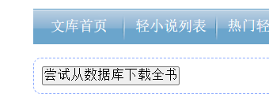
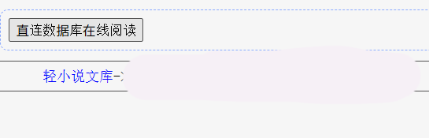
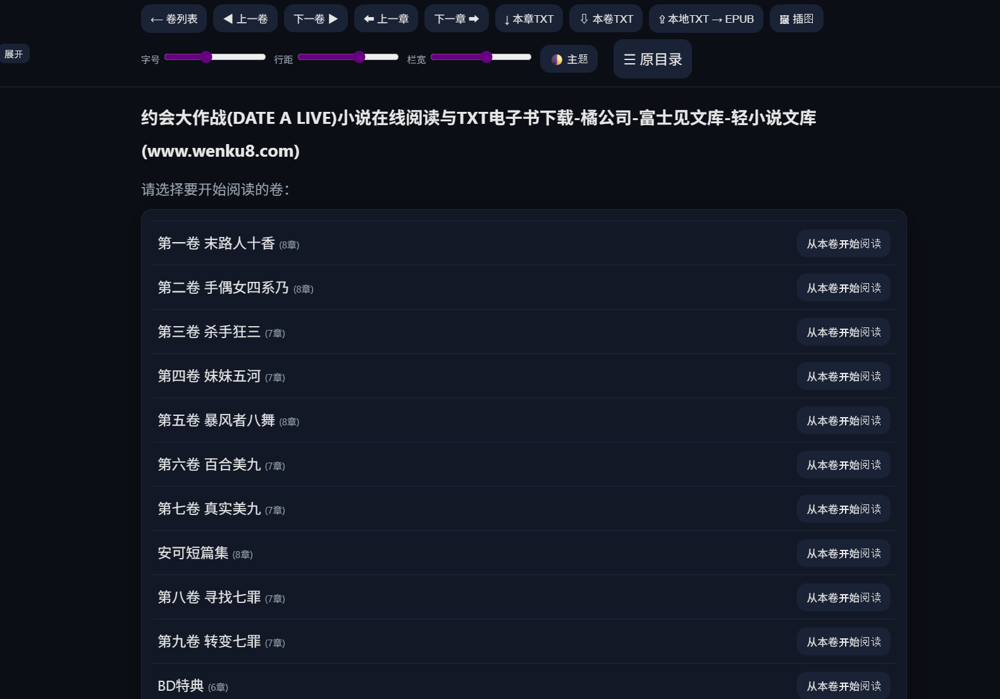
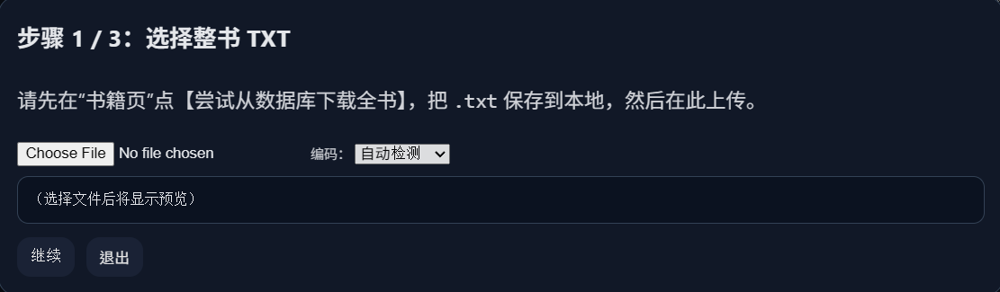
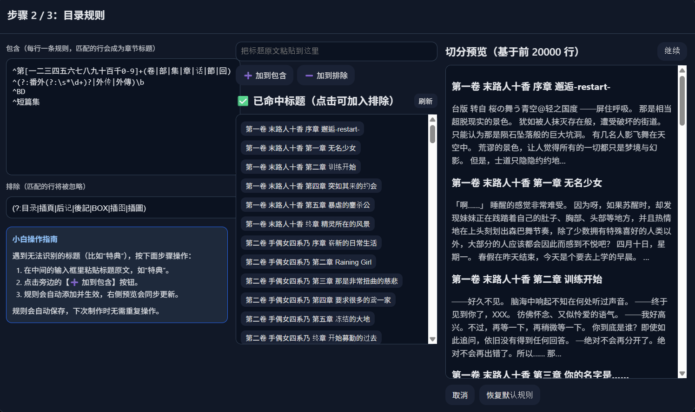
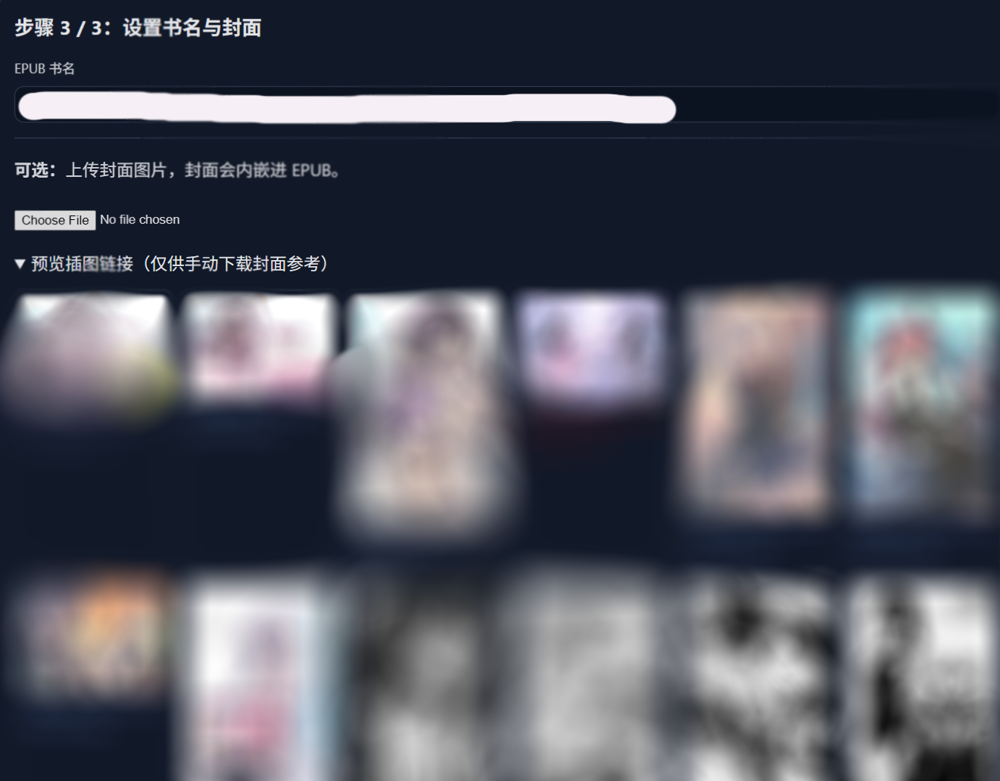

# Wenku8 Helper

> 🪶 **A modern Tampermonkey userscript for Wenku8 — enabling full-book reading, EPUB export, and clean UI.**

---

## 🚀 Install

[👉 **Click to install (Tampermonkey)**](https://raw.githubusercontent.com/Gnlop/wenku8-helper/main/Wenku8-Helper.user.js)

> Requires **Tampermonkey** or **Violentmonkey** browser extension.  
> The script will automatically check for updates based on the `@version` field.

---

## ✨ Features

- 📖 **Full-book & volume parsing** — Access entire books or single volumes directly.  
- ⚙️ **Smart chapter splitting** — Regex-based detection with editable rules.  
- 💾 **Local export** — Save as `.txt` or convert to `.epub` (no server required).  
- 🎨 **Modern reader UI** — Dark/light theme, font, line height, and column controls.  
- 🧠 **Persistent preferences** — Remembers layout, font size, and theme per device.  
- 🪶 **Non-intrusive design** — Integrates seamlessly with Wenku8’s layout.

---

## 📸 Screenshots

Below are blurred demonstration screenshots showing the workflow and interface of **Wenku8 Helper**.

### 🟦 Entry Interface

  
  

### 📖 Reading Mode

  

### 📘 TXT → EPUB Export Workflow

  
  
  

> *All textual and visual content in these screenshots is intentionally blurred to avoid displaying copyrighted material.  
> These images serve solely as a technical demonstration of the user interface and workflow.*

---

## ⚖️ Disclaimer

This userscript is provided **for research, educational, and personal archival purposes only**.  
It is **not affiliated with, endorsed by, or supported by Wenku8** or any related entities.  

All literary works, texts, and images accessed through this script are the **property of their respective copyright holders**.  
Users are solely responsible for ensuring that their use of this script complies with all applicable copyright laws and Wenku8’s terms of service.  

The author of this script **does not host, store, or distribute any copyrighted content**, nor encourage any form of infringement.  
By using this script, you acknowledge that you understand and accept these terms.  

> The author assumes no liability for any misuse or damages arising from the use of this software.

---

## ⭐ Star History

---

## 📜 License

Released under the [MIT License](LICENSE).  
© 2025 Gnlop. All rights reserved.

